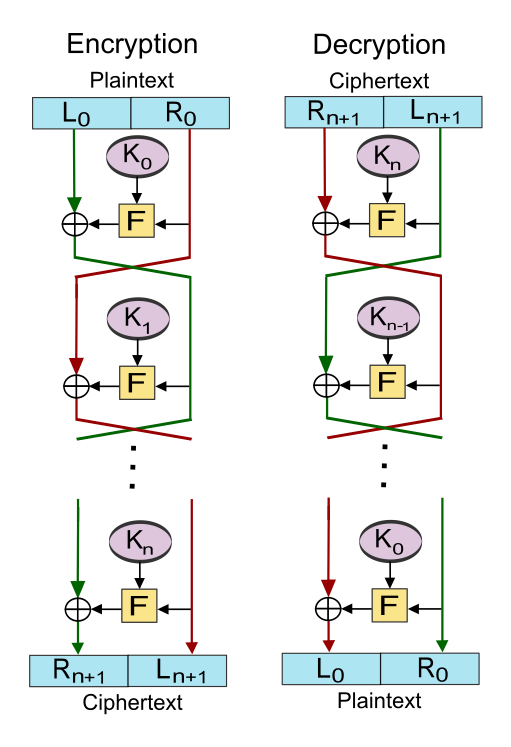

# cryptographic-algorithms-using-python
This project gives you better understanding of cryptographic algorithms by implementing it python.honestly by making i also improve my own understanding of
cryptographic algorithms much more better by making it in python and also learn much more stuff.

1. CAESAR CIPHER
The cipher is made by the Julius Caesar. this is an type of encryption method that encrypt the message by sebtuting substituting or replacing the plain text words by particular set of words corresponding to it. This is a simplest cryptographic algorithm in the cryptogrphic world. It is a type of substitution cipher.

2. FEISTEL CIPHER
This cipher is made by horst feistel. This cipher is a type of block cipher that encrypt the data by dividing it in equal parts and encrypting all blocks seprately and after that joining it all together. The block is encrypted in this following steps:
              1. First the block is divided into two equal parts left and right part.
              2. right part first treated in a function by encryption key the key is round specific.
              3. then the output of the function is xored by the left part of the block.
              4. last step the swapping the right part became left and left become right.

